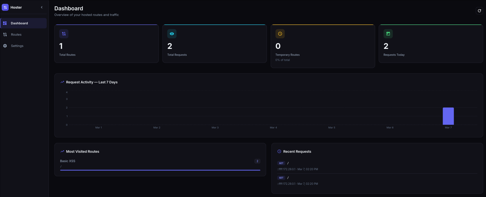
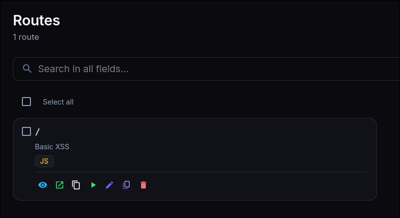
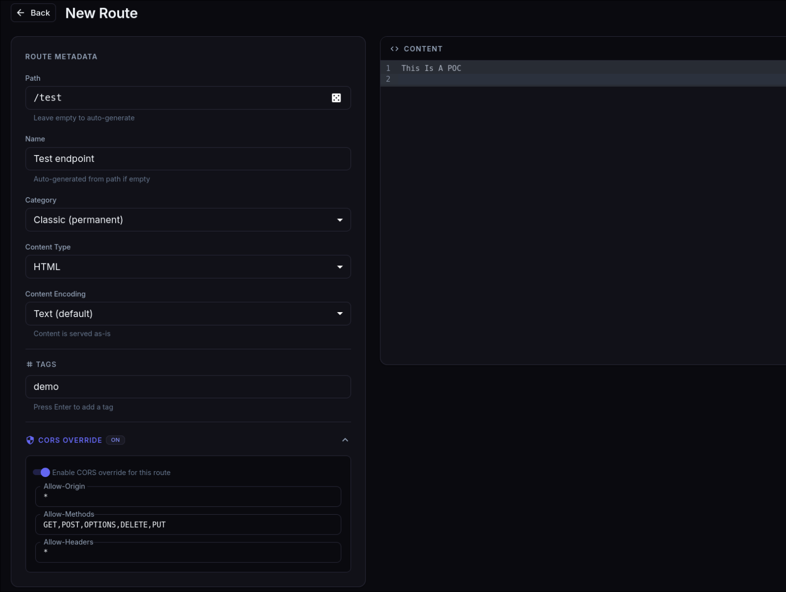
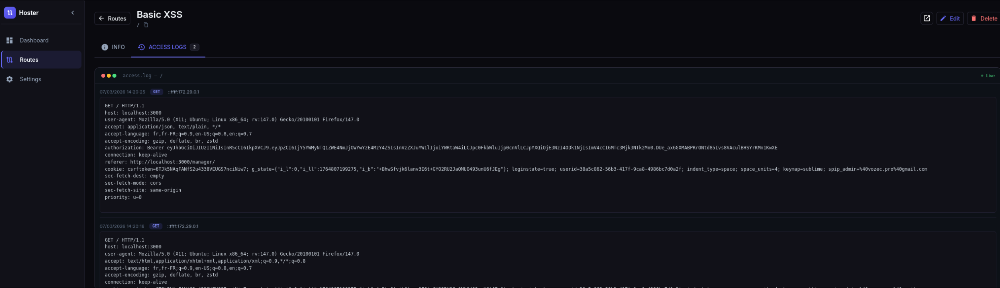

<div align="center">

# Payload Hoster

*Create and serve dynamic routes with a web admin panel, REST API, and CLI*

[](https://opensource.org/licenses/MIT)
[](https://www.docker.com/)
[](https://nodejs.org/)
[](https://reactjs.org/)
[](https://www.mongodb.com/)

</div>

---

## Features

- **Dynamic routing** — serve any content type (HTML, JSON, JS, PHP, XML, binary files)
- **Default root route** — `/` returns `It Works` out of the box, editable at any time
- **File upload mode** — upload binary files served as raw bytes with optional `Content-Disposition`
- **Image preview** — images are rendered inline in the route detail view
- **CodeMirror editor** — syntax highlighting and line numbers for text content
- **Tags** — tag routes and filter by tag in the UI and CLI
- **Sort and pagination** — sort routes by date, path or name; 20 routes per page
- **Rate limiting** — configurable per-route request rate limit (max requests / window)
- **Dashboard** — stat cards and 7-day request activity chart
- **Grid and list view** — toggle between card grid and compact list in the Routes page
- **Real-time logs** — per-route access logs streamed over WebSocket with auto-reconnect
- **Log search and export** — filter logs by IP/content/method, export as JSON or CSV
- **Log TTL** — access logs are automatically pruned after 90 days
- **CORS control** — global config in Settings with per-route override
- **Custom response headers** — global defaults in Settings, overridable per route
- **Export / Import** — backup and restore routes as JSON, with optional AES-256 encryption
- **Clone routes** — duplicate any route to a chosen path or a random one
- **QR code** — generate and download a QR code for any route URL
- **Route test dialog** — send live test requests from the UI
- **REST API** — full API at `/api/v1/` authenticated with an API key
- **Python CLI** — feature-complete CLI with an interactive TUI mode and shell completion
- **PHP support** — evaluate PHP code for dynamic responses
- **JWT-protected admin** — session-based authentication for the admin panel

---

## Installation

### Prerequisites

- [Docker](https://www.docker.com/) and [Docker Compose](https://docs.docker.com/compose/)
- [Python 3.8+](https://www.python.org/) for the CLI

### Setup

```bash
git clone https://github.com/vozec/payload-hoster.git
cd payload-hoster
```

Create a `.env` file at the root:

```env
PORT=3000
HOSTER_URL=http://localhost:3000
JWT_SECRET=change_me
TEMPORARY_DELAY=7

MONGODB_USER=admin
MONGODB_PASSWORD=password

ADMIN_USERNAME=admin
ADMIN_PASSWORD=admin123
ADMIN_PATH=/manager/

API_PATH=/api
API_KEY=first_api_key,second_api_key
```

```bash
make rebuild     # clean volumes, build frontend, start stack
```

Or without Make:

```bash
cd frontend && npm run build
docker-compose --env-file .env up --build
```

The admin panel will be at `http://localhost:3000/manager`.

| Make target | Description |
|---|---|
| `make rebuild` | Full reset: wipe all volumes (including DB), rebuild frontend, restart |
| `make build` | Rebuild the React frontend only |
| `make up` | Start the Docker stack |
| `make clean` | Remove frontend volumes, keep MongoDB data |
| `make clean-all` | Remove all volumes including MongoDB |
| `make logs` | Tail all service logs (`service=backend` to filter) |

---

## Admin Panel



Log in with the credentials from your `.env`. The landing page (Dashboard or Routes) is configurable in Settings > Preferences.



The Routes page supports grid/list view, sorting, full-text search, and tag/category filters. Click any card to open the detail view. Actions (copy URL, test, edit, clone, delete) are available on each card without navigating away. Click the route name or path in the detail view to copy the full URL to the clipboard.

### Creating a route



| Field | Description |
|---|---|
| Path | Route path (e.g. `/my-route`). Leave empty to auto-generate a random slug. |
| Name | Auto-generated from path if empty. |
| Category | Classic (permanent) or Temporary. |
| Content Type | HTML, JSON, JS, PHP, XML, plain text, or any custom MIME type. |
| Content Encoding | `Text` — type in the editor. `Base64`/`Hex` — type raw encoded data, server decodes before serving. `File` — upload a binary file served as-is. |
| Tags | Press Enter after each tag. |
| CORS Override | Per-route CORS headers, overrides global settings. |
| Custom Headers | Additional response headers for this route only. |
| Content-Disposition | For file mode: `inline`, `attachment`, or custom value. |
| Rate Limit | Optional per-route request throttling (max requests / window in seconds). |

### Route details and logs



Click any route to see its metadata and access logs. The log tab streams new requests in real time over WebSocket (with reconnect indicator). Logs can be filtered by IP, content, or HTTP method, and exported as JSON or CSV. The QR code and single-route export buttons are in the header. Click the content preview to jump to the edit page.

### Settings

| Tab | Description |
|---|---|
| CORS | Global `Allow-Origin`, `Allow-Methods`, `Allow-Headers` |
| Response Headers | Default headers sent on every dynamic route response |
| Preferences | Landing page after login |

---

## REST API

Include your API key in every request:

```bash
curl http://localhost:3000/api/v1/routes \
  -H "X-API-Key: first_api_key"
```

| Method | Endpoint | Description |
|--------|----------|-------------|
| GET | `/api/v1/routes` | List all routes |
| GET | `/api/v1/routes/:id` | Get a route |
| POST | `/api/v1/routes` | Create a route |
| PUT | `/api/v1/routes/:id` | Update a route |
| DELETE | `/api/v1/routes/:id` | Delete a route |
| POST | `/api/v1/routes/:id/clone` | Clone a route |
| GET | `/api/v1/stats` | System statistics |
| GET | `/api/v1/logs` | Recent access logs |

---

## MCP server (for AI agents)

Hoster ships an [MCP](https://modelcontextprotocol.io) server that exposes every feature of the platform — creating routes, browsing logs, editing CORS, importing/exporting payloads — directly to AI agents (Claude, custom agents, etc.).

The service runs as a sidecar of `docker compose up` on `MCP_PORT` (default `3333`), reachable at `http://localhost:3333/mcp` over the Streamable HTTP transport.

**Tools exposed:** `list_routes`, `get_route`, `create_route`, `update_route`, `delete_route`, `delete_routes`, `clone_route`, `get_route_logs`, `get_logs`, `get_stats`, `get_cors_config`, `update_cors_config`, `get_custom_headers`, `update_custom_headers`, `export_routes`, `import_routes`.

**Resources exposed:** `hoster://routes`, `hoster://routes/{id}`, `hoster://routes/{id}/logs`, `hoster://logs`, `hoster://stats`.

### Configuration

In `.env`:

```ini
MCP_PORT=3333
# Defaults to first key from API_KEY when empty
MCP_HOSTER_API_KEY=
# Bearer / X-API-Key required from MCP HTTP clients (defaults to MCP_HOSTER_API_KEY)
MCP_AUTH_KEY=
```

### Connect Claude Desktop / a remote agent (HTTP)

```json
{
  "mcpServers": {
    "hoster": {
      "url": "http://localhost:3333/mcp",
      "headers": { "X-API-Key": "first_api_key" }
    }
  }
}
```

### Run locally over stdio

```bash
cd mcp && npm install
HOSTER_URL=http://localhost:3000 \
HOSTER_API_KEY=first_api_key \
MCP_TRANSPORT=stdio \
node src/server.js
```

---

## CLI

### Installation

```bash
pip install -r requirements.txt
chmod +x ./hoster
sudo ln -s "$(pwd)/hoster" /usr/local/bin/hoster
hoster setup --key "first_api_key" --server "http://localhost:3000/api"
```

### Interactive TUI

```bash
hoster ui
```

Full menu-driven interface for all operations, powered by `questionary` and `rich`. Also triggered by running `hoster` with no arguments in an interactive terminal.

### Commands

**Upload**

```bash
hoster up payload.html                          # text file
hoster up image.png --file-mode                 # binary file, served raw
hoster up report.pdf --file-mode --disposition "attachment; filename=report.pdf"
hoster up data.json --path /api/data --ct json
hoster up script.js --permanent                 # permanent route (default: temporary)
hoster up page.html --tags xss,demo
hoster up page.html -H "X-Frame-Options: DENY"  # custom response header
hoster up binary.bin --base64                   # store as base64, server decodes
hoster up live.html --watch                     # re-upload on every file change
```

**List and manage**

```bash
hoster ls                          # all routes
hoster ls --tag xss
hoster ls --category temporary

hoster rm <name>                   # delete
hoster clone <name>                # clone to a random path
hoster clone <name> --path /copy   # clone to a specific path
hoster open <name>                 # open URL in default browser
hoster url <name>                  # print URL
hoster test <name>                 # send a test request
```

**Edit**

```bash
hoster edit myroute -c "new content"
hoster edit myroute -f file.html
hoster edit myroute -n "new name"
hoster edit myroute --ct json
hoster edit myroute --category classic
```

**Tags**

```bash
hoster tag myroute xss demo
hoster untag myroute demo
```

**CORS**

```bash
hoster cors                                         # view global config
hoster cors --origin "*" --methods "GET,POST"       # update global config
hoster cors myroute --origin "https://example.com"  # per-route override
```

**Custom response headers**

```bash
hoster headers myroute --set "X-Custom: value"
hoster headers myroute --remove "X-Custom"
```

**Logs**

```bash
hoster logs             # live stream, all routes
hoster logs myroute     # specific route
```

**Export / Import**

```bash
hoster export routes.json
hoster export routes.enc --password "secret"
hoster import routes.json
hoster import routes.enc --password "secret"
```

**Shell completion**

```bash
# bash
eval "$(hoster completion --shell bash)"

# zsh
eval "$(hoster completion --shell zsh)"
```

---

<div align="center">

~~Developped~~ Vibecoded by [Vozec](https://github.com/vozec)

</div>
